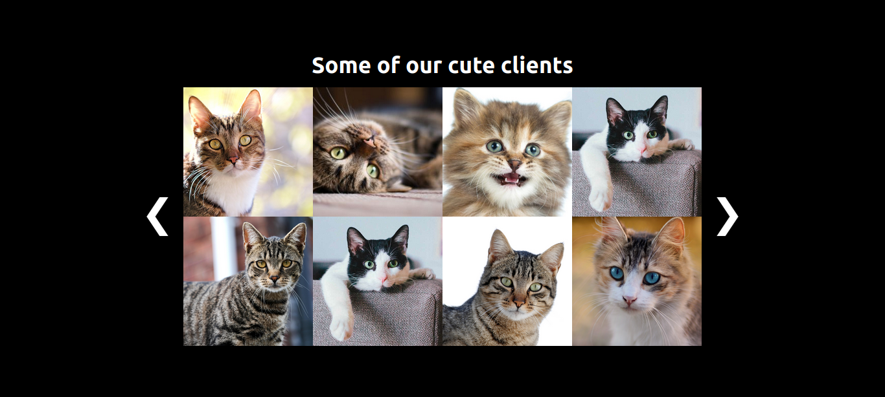

# vaqGrid
This CDN helps developers to set a gallery very easy in their static web proyects.
You will need a js file of your data to show all images in it, but you can also try using data from an API.
____
### [ V1.0.0 ]

## Remember, this is the **source code** of the proyect, here are the instructions to use the **CDN**:

___

**The CDN files you will need**
* [https://cowboycode.sfo3.digitaloceanspaces.com/vaqGrid/vaqGrid.min.js](https://cowboycode.sfo3.digitaloceanspaces.com/vaqGrid/vaqGrid.min.js)

* [https://cowboycode.sfo3.digitaloceanspaces.com/vaqGrid/vaqGrid.min.css](https://cowboycode.sfo3.digitaloceanspaces.com/vaqGrid/vaqGrid.min.css)

The **JS CDN** will create and fill the gallery component.

The **CSS CDN** will set the style to the component, (*you can overwrite everything you need in your proyect*).

___

### In this case, it is using a **JS** file with the **data**.

<code>

    const clients = {
        galeryTitle:"Some of our cute clients",
        galeryItems: 
        [
            {
                name:"Catty",
                image:"./images/clients/client-1.jpg",
                link:"https://www.instagram.com/alejandrovaqueral",
                iconUrl:"./icons/instagram-icon.png",
            },
        ]
    }

</code>

## You will need to create a config file
 To set your data list, create a **configGrid.js** file and set your own title and data.

<code>

    function configList(){
        list = clients.galeryItems;//your own data list
        title = clients.galeryTitle;//your own data title
    }

</code>

**it is only a function**
 ___

## Remember link the config file before the **JS CDN** in your static html file like this:

<code>

    
    
    
</code>

___

If you set your background as **#000** and set your own images and icons in the list, it will look like this:

___
If you have some problem with the style and/or functionality feel free to send a comment in the [issues](https://github.com/AlejandroVaqueraLopez/vaqGrid/issues) section!